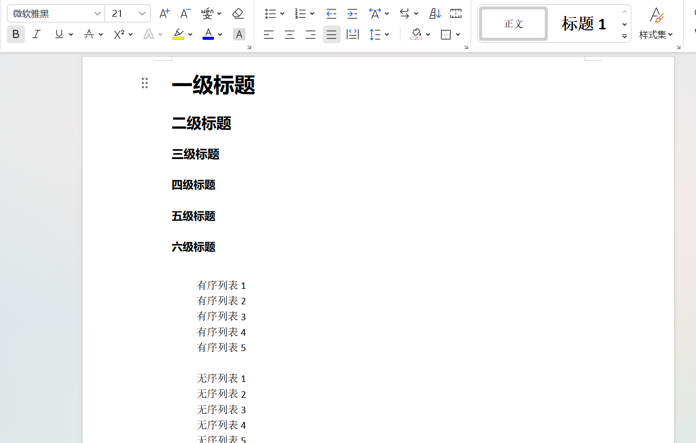
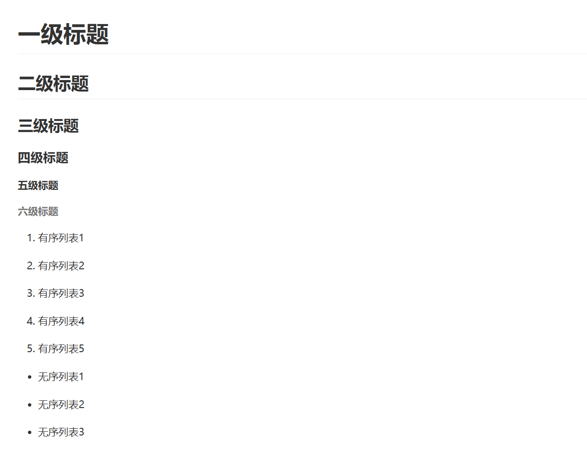

[中文](README.md) | [English](README_en.md)

# docx2markdown

docx2markdown 是一个可以把 docx 文件中内容转换为 markdown 的 python 库。

目前支持：
- 一级到六级标题
- 文本和样式
- 超链接
- 代码块
- 有序列表
- 无序列表
- 表格
- 图片

使用示例：

```python
import os
from docx2markdown.docx_to_markdown_converter import docx_to_markdown

# docx 文件路径
docx = os.path.join(os.path.dirname(os.path.abspath(__file__)), '测试.docx')

# markdown 文件输出路径
output = os.path.join(os.path.dirname(os.path.abspath(__file__)), '测试.md')

# 开始转换
docx_to_markdown(docx, output)
```

docx 文档



转换后的 markdown



# 生成分发文件

在项目根目录下运行以下命令来生成分发文件（tar.gz 和 .whl 文件）
```bash
python setup.py sdist bdist_wheel
```

上传到 PyPI
```bash
twine upload dist/*
```

# 本地安装

通过以下命令将项目安装到当前 python 环境中：
```bash
pip install /path/to/docx2markdown
```

如果你在开发过程中，并且希望对项目做的修改即时生效，可以使用 -e（editable）选项进行安装：
```bash
pip install -e /path/to/docx2markdown
```

这样会创建一个指向项目源代码的符号链接，每次修改源代码时，项目会自动更新。
