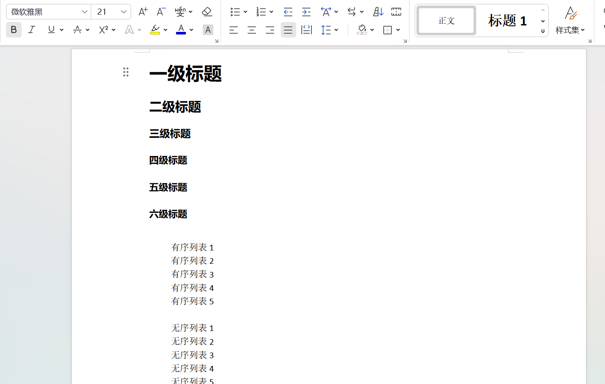

# docx2markdown

docx2markdown is a Python library that converts content from DOCX files to Markdown.

Currently supported:

- Headings from level 1 to level 6
- Text and styles
- Hyperlinks
- Code blocks
- Ordered lists
- Unordered lists
- Tables
- Images

Example usage：

```python
import os
from docx2markdown.docx_to_markdown_converter import docx_to_markdown

# Path to the docx file
docx = os.path.join(os.path.dirname(os.path.abspath(__file__)), 'example.docx')

# Path for the markdown file output
output = os.path.join(os.path.dirname(os.path.abspath(__file__)), 'example.md')

# Start conversion
docx_to_markdown(docx, output)
```

docx document



markdown


# Generating Distribution Files

Run the following command in the project root directory to generate distribution files (tar.gz and .whl files):

```bash
python setup.py sdist bdist_wheel
```

Upload to PyPI:
```bash
twine upload dist/*
```

# Local Installation

Use the following command to install the project into the current Python environment:
```bash
pip install /path/to/docx2markdown
```

If you're in development and want the changes to take effect immediately, use the -e (editable) option:
```bash
pip install -e /path/to/docx2markdown
```

This will create a symbolic link to the source code, so the project will automatically update each time the source code is modified.
